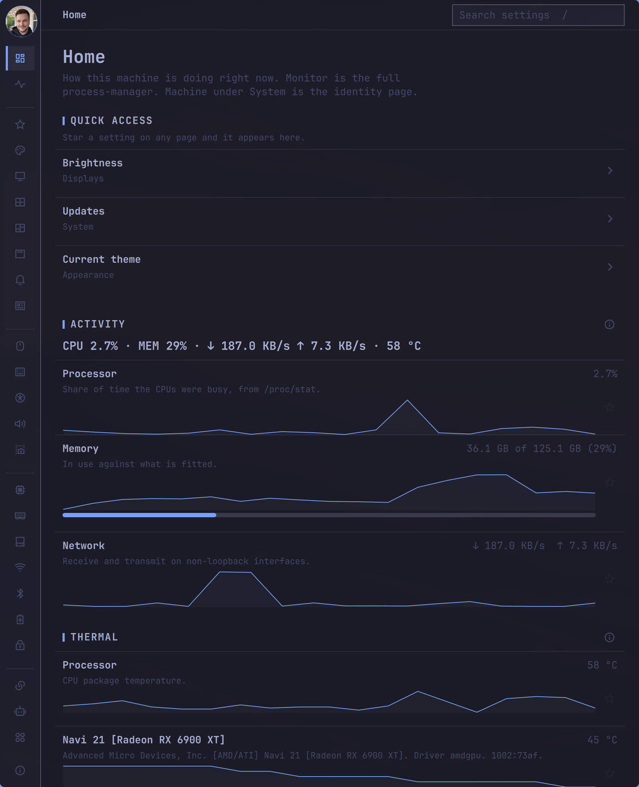
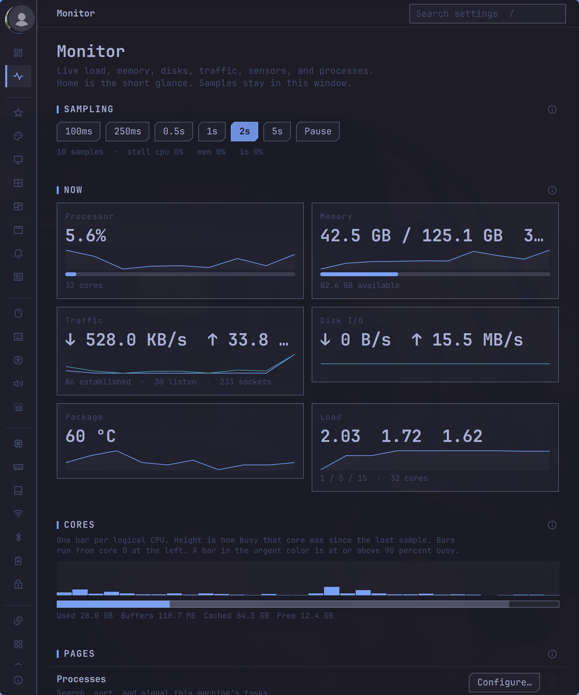
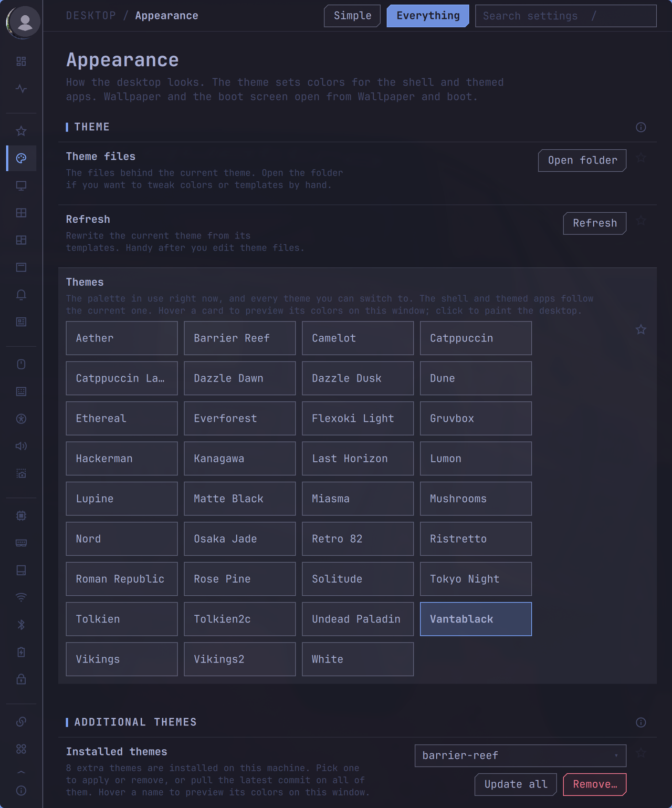
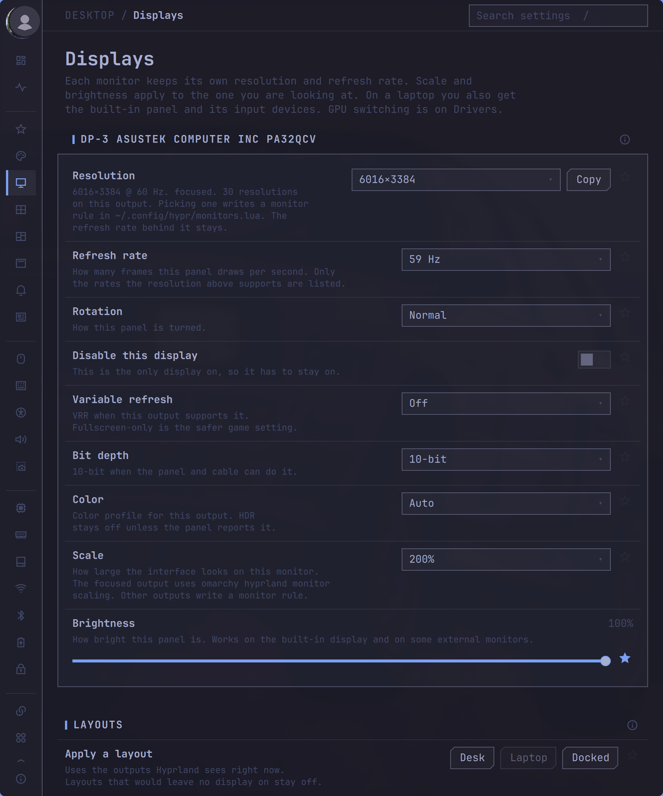
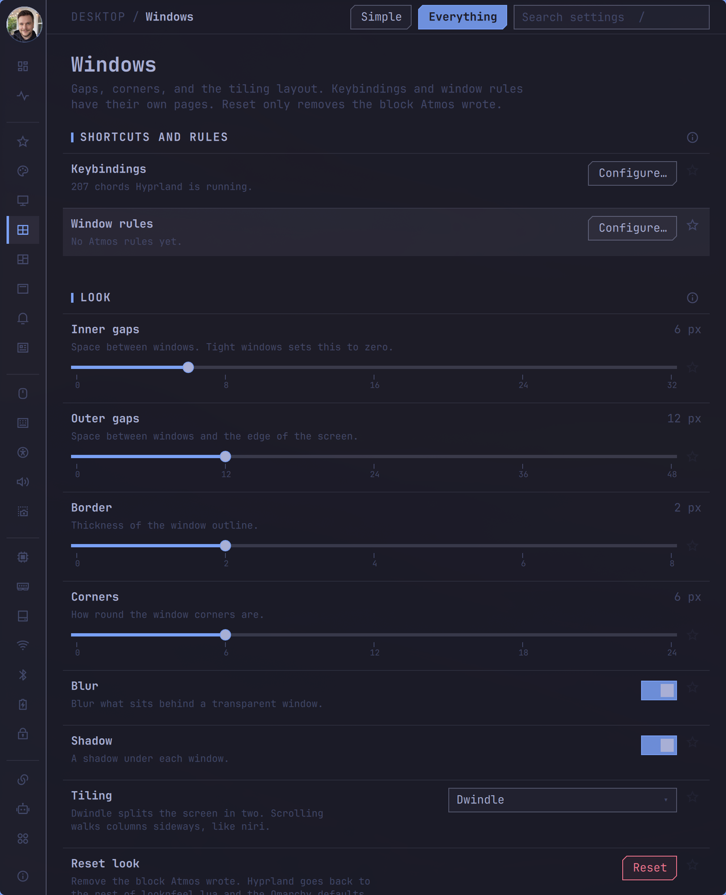

# Atmos

[](https://github.com/csfh/atmos/actions/workflows/tests.yml)
[](https://github.com/csfh/atmos/releases)
[](LICENSE)
[](https://github.com/tcballard/omarchy-badges)

**Preferences for Omarchy — themes, the bar, network, power, and the rest of this machine.**

A standalone [Quickshell](https://quickshell.org) preferences window for [Omarchy](https://omarchy.org). It follows the active theme and writes through `omarchy` commands and Hyprland drop-ins. There is no private prefs store: settings live in `~/.config`. Atmos runs on Omarchy with Hyprland only.

[](https://atmos.csfh.dev)

Site: [atmos.csfh.dev](https://atmos.csfh.dev) · source for it in [`site/`](site/).

<p>
  
  
</p>
<p>
  
  
</p>

## Features

- **Theme-aware chrome** from the current Omarchy theme. Hover a theme to preview it in this window.
- **Writes through `omarchy` and Hyprland sentinels**, not a second store.
- **Home and Monitor** — live load, cores, memory, disk I/O, traffic, sensors, processes. Samples stay in the window.
- **Search and keyboard** — `/` or `Ctrl+F` finds a setting; `Ctrl+/` opens the shortcut sheet.
- **Concurrent windows** stay in sync through the files they share. Writes serialize on disk.
- **Diagnostics, Omafile, agents** — copy a machine report, share settings as Markdown, install `atmos mcp`.

<details>
<summary>All hubs</summary>

Home, Monitor, Favorites, Appearance, Displays, Windows, Workspaces, Bar, Notifications, Profiles, Input, Keybindings, Accessibility, Sound, Capture, Hardware, Drivers, Disks, Network, Bluetooth, Power, Idle, Defaults, Agentic, Applications, Software, Hooks, System, Tweaks, Omafile, Accounts, Security, Services.

</details>

## Install

Needs an [Omarchy](https://omarchy.org) system (Hyprland) and `~/.local/bin` on `PATH`.

- **Install script** follows the `stable` branch and updates from inside the app:

  ```bash
  curl -fsSL https://raw.githubusercontent.com/csfh/atmos/stable/install.sh | bash
  ```

  It needs `git`, `python3`, `cargo`, and `quickshell`, and checks for them.

- **Omarchy package** updates with `omarchy update`. Hyprland integration is opt-in per user:

  ```bash
  sudo pacman -S omarchy-atmos
  atmos --setup
  ```

Then run `atmos`, or open it from the app launcher. Details, update, and uninstall are in [docs/install.md](docs/install.md).

## Usage

```bash
atmos
atmos appearance
atmos windows/bindings
atmos network/wifi
```

Every launch opens its own window. Pass a hub or child page to land there. From a source checkout, `./bin/atmos` is the same launcher.

| Key | Does |
| --- | --- |
| `/` or `Ctrl+F` | Search settings |
| `Ctrl+/` | Shortcut sheet |
| `↓` `↑` or `Ctrl+J` `Ctrl+K` | Move through the list, even from the search field |
| `Home` `End` | First and last row |
| `Enter` | Open the selected row |
| `Esc` | Back, clear search, or revert a pending display or input change |

## Footprint

ratmos 0.1.0, measured 10 October 2026 on one machine:

| | |
| --- | --- |
| `ratmos` binary | 1.9 MB |
| One-shot request | 566 µs |
| `ratmos serve`, idle 10 s | 2.0 MB RSS, 0 CPU ticks |

This is the backend, not the window, and it describes one machine and workload. Method and caveats: [docs/benchmarks.md](docs/benchmarks.md).

## More

- [Install, update, uninstall](docs/install.md)
- [Configuration](docs/configuration.md) — the files Atmos reads and writes
- [Troubleshooting](docs/troubleshooting.md)
- [Protocol](docs/protocol.md) — what the window and `ratmos` say to each other
- [Benchmarks](docs/benchmarks.md)
- [Changelog](CHANGELOG.md)

## Contributing

See [CONTRIBUTING.md](CONTRIBUTING.md). A pull request agrees to the [CLA](CLA.md).

```bash
npm install
./tests/run
```

`./tests/run` is the whole suite, and pull requests and pushes to `main` and `stable` run it on GitHub Actions. `npm install` points Git at `.githooks/`, whose pre-commit hook runs the lint, format, Rust, and file-size checks and refuses a commit that has staged files with later unstaged edits (`git commit --no-verify` skips it). [AGENTS.md](AGENTS.md) lists the checks and the rules for the code.

## License

MIT. See [LICENSE](LICENSE). Copyright (c) 2026 Christoffer Hallas.

UI glyphs in `icons/` are from [Remix Icon](https://remixicon.com), Remix Icon License v1.0. See [icons/NOTICE](icons/NOTICE).
